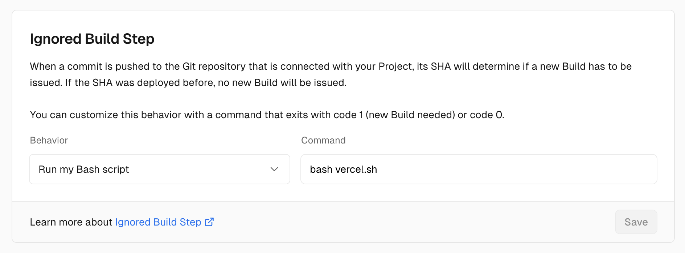

# vercel-build

- If a change is made only to `backend/`, do not build.
- Otherwise, build (including `src/` and root directory)
- `git diff` doesn't return correct error codes, so need to be creative

## How to use

1. Add `vercel.sh` to the root of your repo. Modify the script as necessary.
2. Vercel > Settings > Git > Ignored Build Step. Set it up to `bash vercel.sh`
https://vercel.com/guides/how-do-i-use-the-ignored-build-step-field-on-vercel



3. See the build is cancelled
```
[14:10:49.937] Running build in Washington, D.C., USA (East) – iad1
[14:10:50.059] Cloning github.com/org/repo (Branch: main, Commit: 7b91ea6)
[14:10:50.581] Cloning completed: 521.12ms
[14:10:50.587] Running "bash vercel.sh"
[14:10:50.624] The Deployment has been canceled as a result of running the command defined in the "Ignored Build Step" setting.
[14:10:53.757]
```
